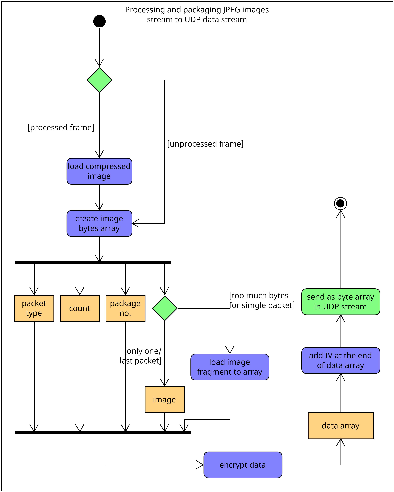
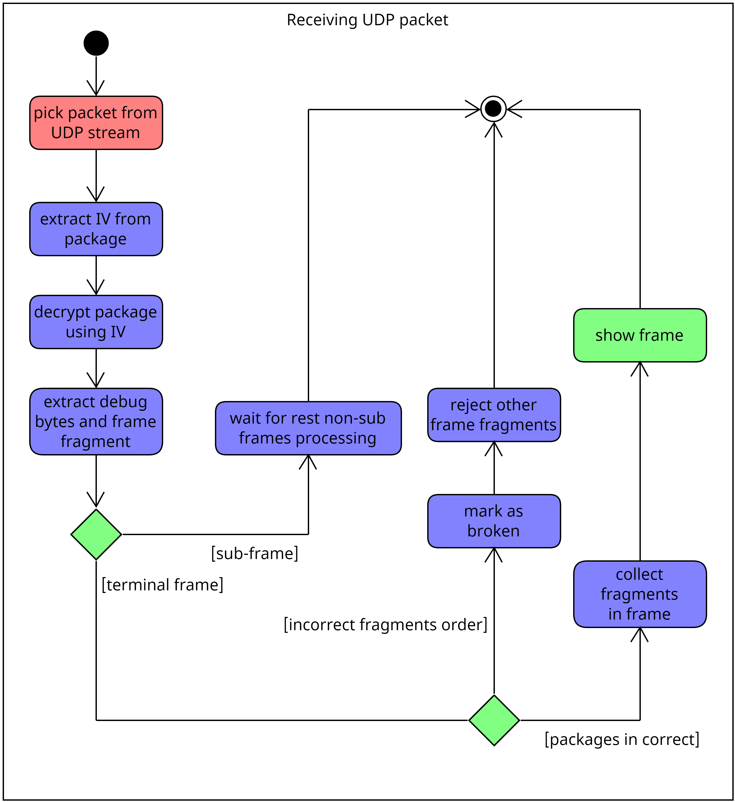
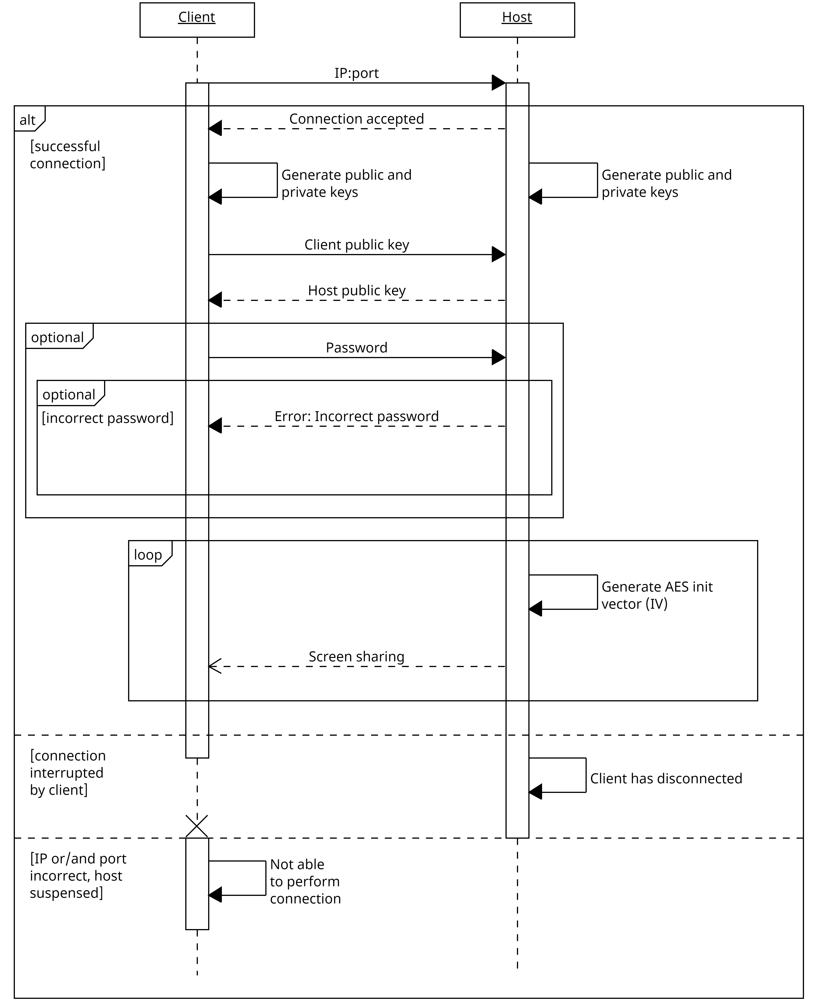
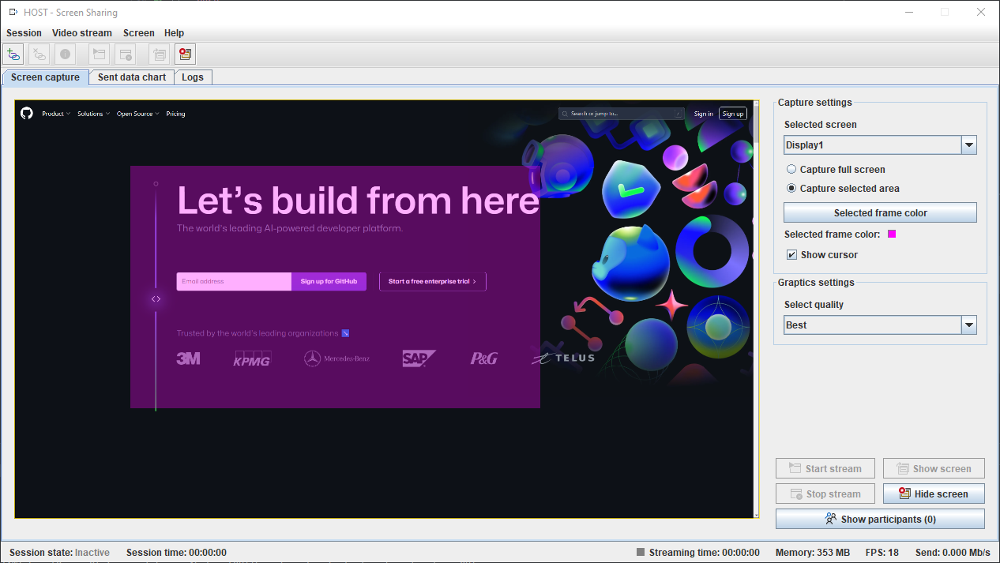
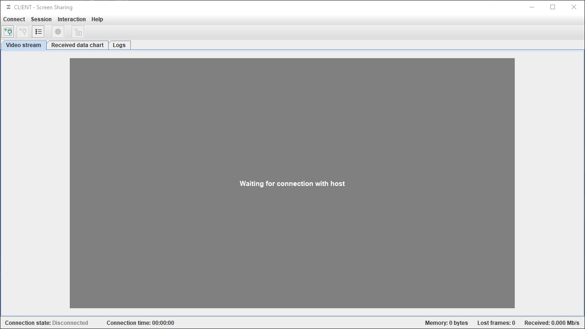

# Screen sharing system

Secured screen sharing system created with low-level Socket API written in Java SE 1.8 with JCA, JCE and Swing UI. Uses
event-based reactive programming with observer pattern supplied by [RxJava](https://github.com/ReactiveX/RxJava)
library.

[YouTube Demo](https://www.youtube.com/watch?v=zfW8Ah0KPZM)

## Table of content

* [Package error correction system](#package-error-correction-system)
* [Sequence diagram](#sequence-diagram)
* [Host and Client window](#host-and-client-window)
* [Clone and install](#clone-and-install)
* [Prepare configuration and run](#prepare-configuration-and-run)
* [Tech stack](#tech-stack)
* [Project status](#project-status)
* [License](#license)

<a name="package-error-correction-system"></a>

## Package error correction system

App supports HD resolution, so each frame is split into smaller chunks due to the maximum UDP frame size (65kb). I
decided to create simple error correction system, because UDP protocol can loose the packets which caused visible
artifacts in result video stream.

*TL;DR:* If the image fragments were not transmitted in the correct order, frame is not
displayed in the user interface. Solves the problem of displaying artifacts in the image.




<a name="sequence-diagram"></a>

## Sequence diagram



<a name="host-and-client-window"></a>

## Host and Client window

* Host window
  


* Client window
  

<a name="clone-and-install"></a>

## Clone and install

To install the program on your computer, use the command below (or use the build-in GIT system in your IDE environment):

```
$ git clone https://github.com/Milosz08/screen-sharing-system
```

<a name="prepare-configuration-and-run"></a>

## Prepare configuration and run

1. Build and install shared library via:

```bash
$ mvn -N clean package install
```

2. Create executable JAR file for modules:

```bash
$ mvn -pl "<module>" clean assembly:assembly
```

where `<module>` is `client` or `host`.

3. Optionally, build all modules via (for UNIX system):

```bash
$ ./package
```

or for Windows system:

```cmd
.\package.bat
```

All executable JAR files will be available in `.bin` directory.

<a name="tech-stack"></a>

## Tech stack

* Java SE 1.8
* JCA (Java Cryptography Architecture)
* JCE (Java Cryptography Extension)
* Swing UI, AWT
* RxJava (reactive pattern)
* Imgscalr (image processing)
* Apache Commons Lang, IO (utilities)
* Logback with Slf4j api
* JFreeChart (data transfer linear plot)
* Bcrypt (password hashing)
* Lombok (accessor annotations)
* Jackson (json processing)

<a name="project-status"></a>

## Project status

Project is finished.

<a name="license"></a>

## License

This application is on Apache 2.0 License.
